# Technical Architecture & Design Reference

This is the developer-facing technical knowledgebase for `PredictiveAnalytics` Phase 1 (the
Global Treasury Forecasting & Liquidity Engine, `app/`). It documents *how the system is put
together* — system context, component/container architecture, request-flow sequence diagrams,
class diagrams for every layer, the SOLID/DRY/OOP principles actually applied in the code, and
the code-standards/testing/logging setup enforcing them — as a companion to, not a replacement
for, the existing docs:

- [`CLAUDE.md`](CLAUDE.md) — repo inventory, working conventions, `Business_Report.csv` schema.
- [`app/README.md`](app/README.md) — the module map, configuration reference, endpoint table,
  code-standards/exception-handling mapping, and the *known caveats* (why safety stock looks
  large on thin corridors, why a single backtest holdout is itself a small sample, etc.).
- [`notes.txt`](notes.txt) / [`TODO.md`](TODO.md) — the two-phase plan and open decisions
  (Postgres backend, auth, the Phase 2 agent layer).

Read this file for **the shape of the system** (who calls what, which class owns which
responsibility, where a request's data flows). Read `app/README.md` for **the reasoning behind
each design choice** and the config/endpoint reference tables. When code changes, update the
diagrams here the same way `app/README.md`'s own "Architecture" section gets kept current —
a stale diagram is worse than no diagram.

---

## 1. System context

Who/what talks to this system, and what it talks to in turn:

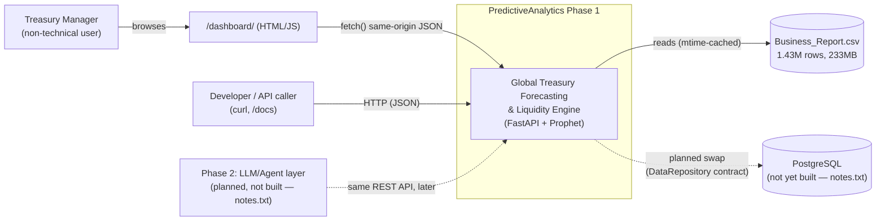

**Key point for anyone extending this system**: the API surface is designed to be
consumed identically by a human (dashboard), a script (`curl`/`/docs`), or — in Phase 2 — an
LLM agent issuing the same JSON requests as tool calls. Nothing in `app/forecasting/` or
`app/api/` assumes a human is on the other end.

---

## 2. Container / component view

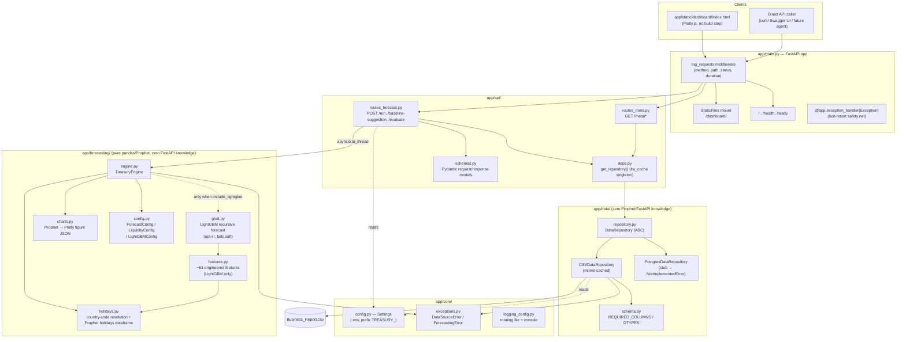

**Layering rule enforced by this codebase** (see `app/README.md`'s "Request flow"): each layer
depends only on the one below it — `app/api/` depends on `app/forecasting/` and `app/data/`;
`app/forecasting/` depends only on `app/data/schema.py` (constants) and `app/core/exceptions.py`,
**never** on FastAPI; `app/data/` depends only on `app/core/`. This is what let the engine be
smoke-tested directly against the CSV during development, with no HTTP server involved at all.

---

## 3. Request-flow sequence diagrams

**Diagram conventions** — every sequence diagram in this file (§3.1–§3.3 and §10.7) follows the
same three rules, so they can be read interchangeably:

| Convention | How it's expressed | Read it as |
| --- | --- | --- |
| **Step numbering** | `autonumber` — mermaid renders 1, 2, 3… on each arrow | Reference a specific hop as "§3.1 step 7" in review comments or commit messages. |
| **Solid arrow** (`->>`) | Teal, filled arrowhead | A **request/call** — caller invoking the next layer, or a participant's own internal step (self-arrow). |
| **Dashed arrow** (`-->>`) | Teal, open arrowhead | A **response/return** — including a raised exception travelling back up (`raise DataSourceError`) and the final HTTP status. |
| **Participant boxes** | Navy, white text, rounded (`look: "neo"`) | Rounded + soft-shadowed via mermaid's `neo` look; each box is one module/class, named after the actual file or type. |

The palette is pinned via a `%%{init: …}%%` block repeated at the top of each diagram. Two honest
caveats about that: mermaid has **no include mechanism**, so the block is duplicated per diagram
(edit all four together — this is the one deliberate DRY exception in this file, same spirit as
§7's ruff/flake8 line-length note); and `themeCSS` is stripped from diagram-level init directives,
so `look: "neo"`'s `rx=6` corner radius is the maximum rounding achievable inside a fenced
markdown diagram. The palette assumes a light page background — participant boxes, notes and
`alt` labels carry their own fills and stay legible either way, but arrow-label text is tuned for
light.

### 3.1 `POST /api/v1/forecast/run` (the main endpoint)

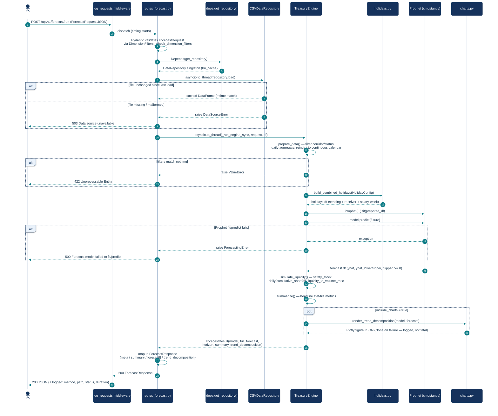

### 3.2 `POST /api/v1/forecast/evaluate` (accuracy backtest)

Same request→repository→engine shape as `/run`, but the engine method differs and there is a
**second, internal Prophet fit** (train/test split), which is why this is its own
caller-triggered endpoint rather than something computed on every `/run`:

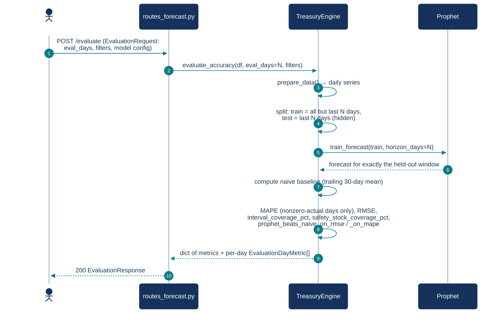

### 3.3 `POST /api/v1/forecast/baseline-suggestion`

Deliberately **no Prophet involved** — it reuses `prepare_data()` on real historical
transactions and reduces the trailing window with one of three methods
(`average` / `weighted_average` / `median`):

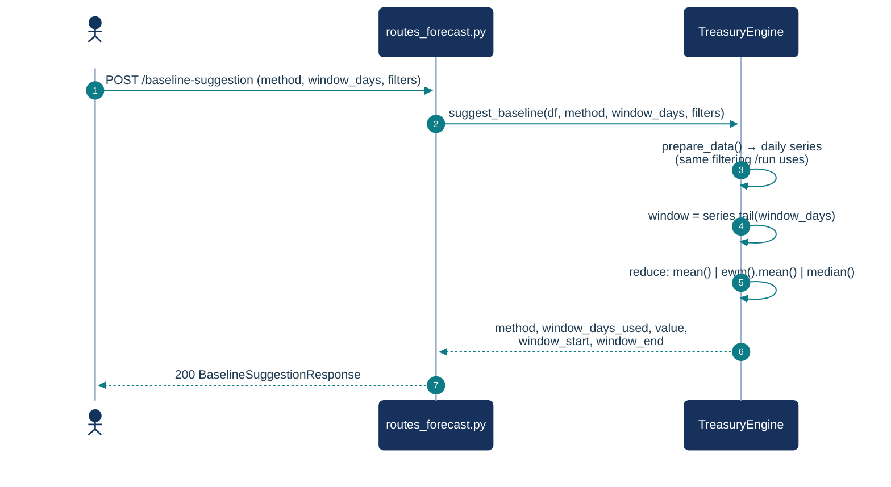

### 3.4 Error-handling flow (applies to every route)

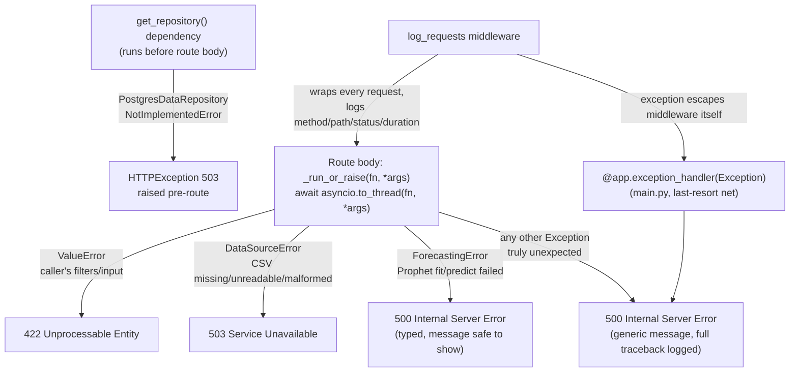

This mirrors the table in `app/README.md`'s "Exception handling" section exactly — see that
section before adding a new failure mode that doesn't fit one of the four boxes above.

---

## 4. Class diagrams

### 4.1 Data access layer (`app/data/`)

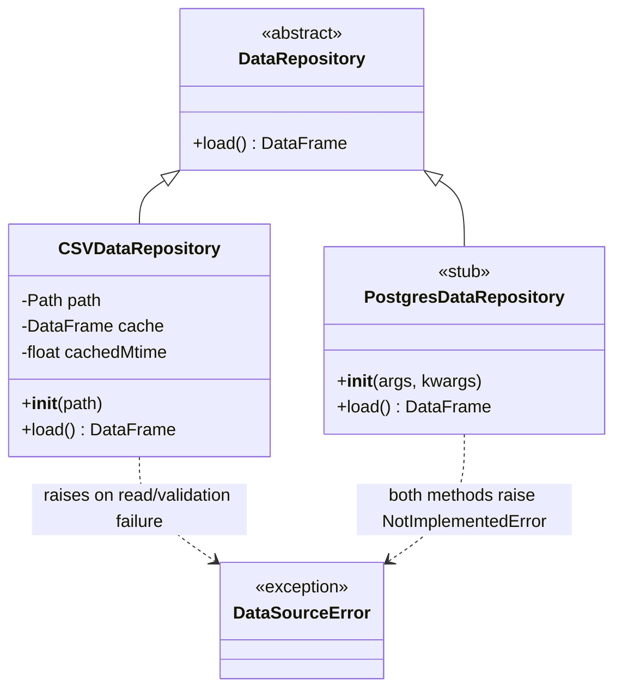

`CSVDataRepository` is the only implementation today. It caches the parsed `DataFrame` in
memory and only re-reads the 233 MB file when `path.stat().st_mtime` changes — so appending
rows to the CSV is picked up on the next request without a service restart, without paying
the full parse cost on every call either. It validates against `REQUIRED_COLUMNS`/`DTYPES`
(`app/data/schema.py`) before committing a load to cache; a failed read/validation is **never
cached**, so a transient failure keeps the previous good cache (or keeps failing loudly) rather
than being silently papered over. `PostgresDataRepository` is a stub: both `__init__()` and
`load()` raise `NotImplementedError` — the DB choice is still open (`notes.txt`).

### 4.2 Forecast configuration (`app/forecasting/config.py`)

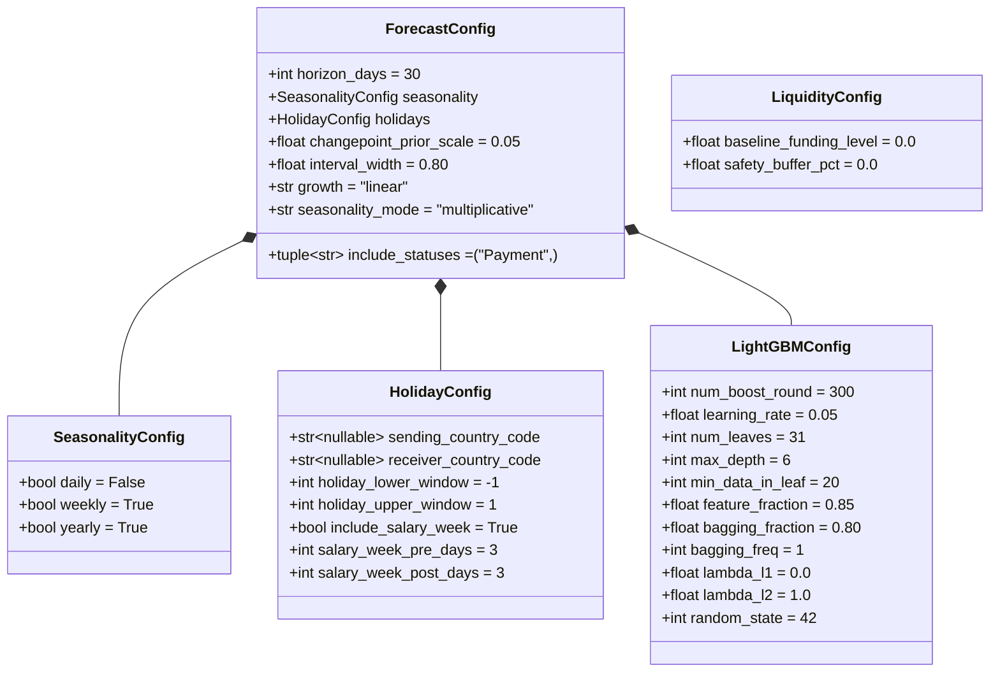

Plain `@dataclass`es, not Pydantic — these are the engine's own internal config, constructed
either directly (Python/notebook callers) or by `app/api/routes_forecast.py` from the
API-facing Pydantic request models (§4.4), which mirror these fields one-for-one.

`seasonality_mode` defaults to `"multiplicative"`, **not** Prophet's own `"additive"` default —
changed after a real defect (additive mode silently flooring a real, nonzero corridor's forecast
to $0.00) found and fixed via the worked example in §10, which also documents the before/after
numbers on real data.

### 4.3 The engine (`app/forecasting/engine.py`)

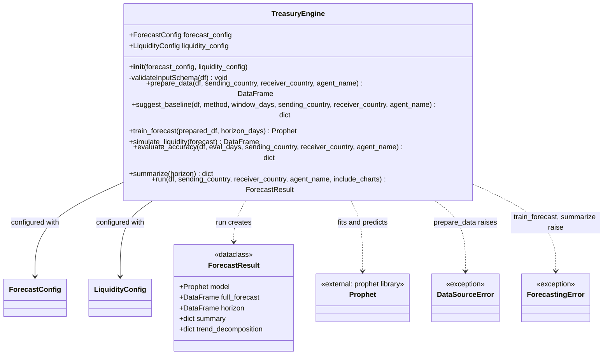

`TreasuryEngine` owns **no data source** — every public method takes a `pd.DataFrame` as an
argument. This is the single most important design decision in this codebase: it's what makes
the engine callable identically from the API, a test, or a notebook, and what will let a
Postgres-backed repository swap in later with zero changes to this class. One instance is
configured for exactly one forecast run (`ForecastConfig` + `LiquidityConfig` passed at
construction, detailed in §4.2); a new request always builds a fresh `TreasuryEngine` (see
`routes_forecast.py:_run_engine_sync`) rather than mutating a shared one. `train_forecast()`
also delegates to `holidays.build_combined_holidays()`, and `run()` delegates to
`charts.render_trend_decomposition()` — both omitted from the diagram as external
helper-module calls rather than class relationships, and both fail soft (see §6).

**Method pipeline** (`run()` orchestrates all four in order):

| Step | Method | Input → Output | Can raise |
| --- | --- | --- | --- |
| 1 | `prepare_data()` | raw transactions → daily `ds`/`y` series (reindexed, gaps = 0) | `DataSourceError` (bad schema), `ValueError` (filters match nothing) |
| 2 | `train_forecast()` | `ds`/`y` → Prophet model + full forecast (history + horizon) | `ValueError` (<2 days), `ForecastingError` (Prophet failure) |
| 3 | `simulate_liquidity()` | forecast → horizon + `safety_stock`/`daily_shortfall`/`cumulative_shortfall`/`liquidity_to_volume_ratio` | — |
| 4 | `summarize()` | horizon → headline dict (total shortfall, peak day, safety-stock ratio, …) | `ForecastingError` (empty horizon, defensive only) |

`suggest_baseline()` and `evaluate_accuracy()` are siblings that reuse step 1
(`prepare_data()`) but don't run the full pipeline — see the sequence diagrams in §3.2/§3.3.

#### 4.3.1 The optional LightGBM comparison path

When `ForecastConfig.include_lightgbm` is true, `run()` adds a fifth step **after**
`simulate_liquidity()` and deliberately outside it:

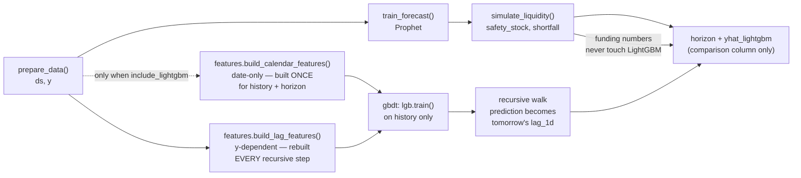

Three properties of this path are load-bearing:

| Property | Why it is that way |
| --- | --- |
| **Calendar features built once, lag features rebuilt per step** | Calendar features depend only on `ds`, so they are knowable for the whole horizon up front. Lag features depend on `y`, which past day 1 does not exist yet. Splitting them is what keeps a 30-day recursive forecast at ~1.5s instead of several. |
| **Fails soft** | A failed or skipped LightGBM fit logs and returns `lightgbm_included=False`; the Prophet forecast still returns 200. Same reasoning as chart rendering (§6) — a second opinion must never cost the caller the answer they asked for. |
| **Never feeds `simulate_liquidity()`** | Measured: a LightGBM quantile band covered 90.3% of held-out days vs Prophet's 96.8% across 36 rolling-origin backtests. Funding decisions stay on the calibrated band. See `app/README.md`'s "Known caveats" for the full evidence including the 376–463% WAPE corridor failure. |

Every lag and rolling feature is shifted before use so no row sees its own target;
`tests/test_features.py::test_no_lag_or_rolling_feature_leaks_current_value` asserts this
against a spike series, because the failure is silent — it produces an excellent backtest
and a worthless forecast.

### 4.4 API request/response schemas (`app/api/schemas.py`, Pydantic)

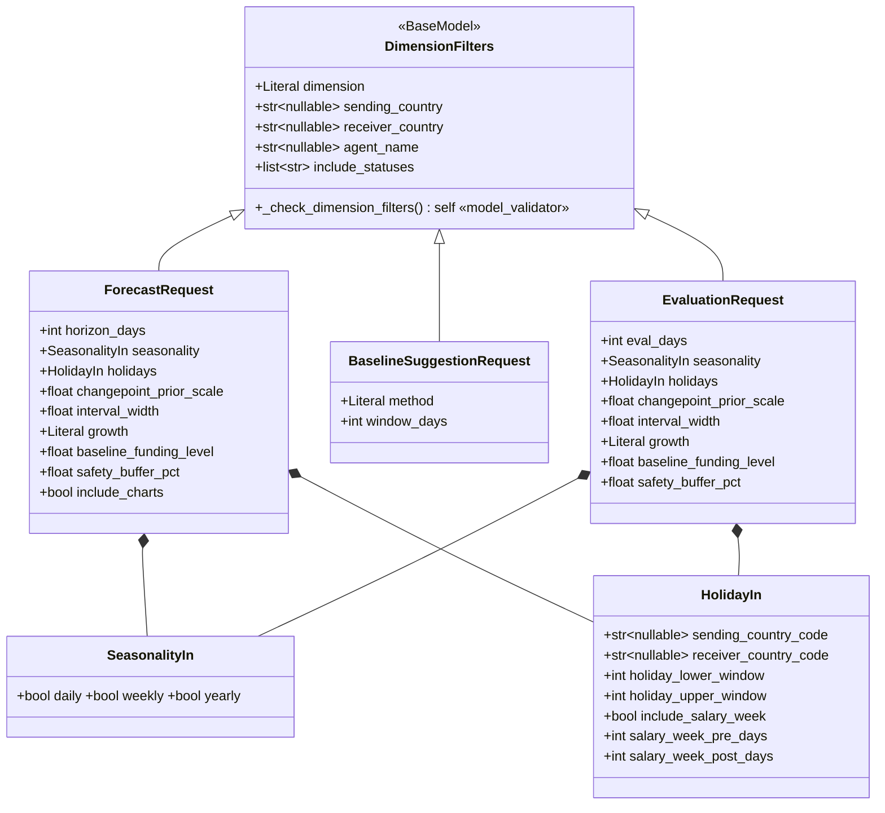

Note `EvaluationRequest` deliberately does **not** subclass `ForecastRequest` even though most
fields are identical — `ForecastRequest.horizon_days` means "days to forecast forward"; an
evaluation instead needs `eval_days` ("days to hide and test against"), a different enough
meaning that inheriting would put a misleading field in the OpenAPI schema.

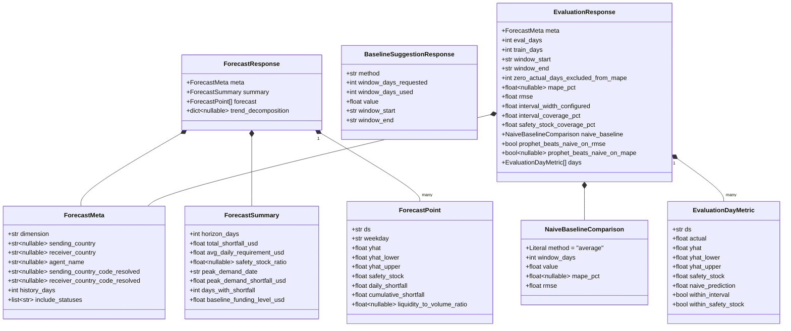

### 4.5 Exception hierarchy (`app/core/exceptions.py`)

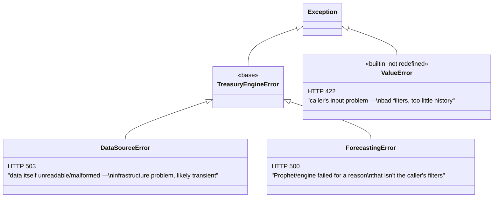

`ValueError` is deliberately **not** redefined as an app-specific type — it's the standard
Python exception for "the input was invalid," raised directly by
`TreasuryEngine.prepare_data()`/`train_forecast()` and by `DimensionFilters`'s Pydantic
validator, and mapped to 422 by `_run_or_raise()` in `routes_forecast.py` like any other typed
exception here.

---

## 5. Domain concepts (fintech glossary for developers new to this system)

These terms recur throughout `app/forecasting/engine.py` and the dashboard; a developer
touching the engine should understand what each one *means financially*, not just its field
name:

| Term | Meaning | Where computed |
| --- | --- | --- |
| **Volume forecast (`yhat`)** | Expected total `Transaction_Amount_USD` (USD-normalized) moving through a corridor/country/agent on a given day. | `TreasuryEngine.train_forecast()` (Prophet's point prediction). |
| **Uncertainty interval (`yhat_lower`/`yhat_upper`)** | Prophet's own confidence band — the model's stated range for where actual volume is expected to fall, at `interval_width` confidence (default 80%). | `train_forecast()`. |
| **Safety stock** | The risk-adjusted amount treasury should actually fund for a day — `yhat_upper` plus an optional extra buffer (`safety_buffer_pct`). Named for the same "buffer against demand uncertainty" concept as inventory safety stock in supply-chain management, applied here to *cash* instead of goods. | `simulate_liquidity()`. |
| **Baseline funding level** | What treasury actually *plans* to fund per day — a plain caller input, never computed by Prophet. Comparing it against safety stock is what surfaces a shortfall. | Caller-supplied (`ForecastRequest.baseline_funding_level`); optionally pre-filled by `suggest_baseline()`. |
| **Daily / cumulative shortfall** | `max(0, safety_stock − baseline)` per day, and its running total across the horizon — the actual "how much more cash do we need" answer. | `simulate_liquidity()`. |
| **Liquidity-to-volume ratio** | `baseline / yhat` — normalizes funding adequacy so corridors of very different sizes (e.g. a $2M/day corridor vs. a $20K/day one) can be compared on the same footing. | `simulate_liquidity()`. |
| **Gap analysis** | The general practice this whole simulation implements: forecasted demand vs. planned funding, day by day, surfaced as shortfall — the term originates in `business_data_send.py`, the single-corridor prototype this engine generalizes. | `TreasuryEngine.run()` end-to-end. |
| **MAPE** (mean absolute percentage error) | Average `\|actual − predicted\| / actual`, as a percentage — computed only over days with nonzero actual volume (undefined at `actual=0`, which real thin corridors do have). | `evaluate_accuracy()`. |
| **RMSE** (root mean squared error) | `sqrt(mean((actual − predicted)²))` — has no zero-actual blind spot, always computed over every held-out day. | `evaluate_accuracy()`. |
| **Interval coverage %** | Of the held-out days, how many had `actual` land inside `[yhat_lower, yhat_upper]` — tests whether the model's *stated* uncertainty is honest. | `evaluate_accuracy()`. |
| **Safety-stock coverage %** | Of the held-out days, how many had `actual ≤ safety_stock` — the more actionable number: would the funding plan actually have been enough. | `evaluate_accuracy()`. |
| **Naive baseline** | A flat trailing-30-day average held constant across the eval window — the "just fund the recent average every day" strawman `evaluate_accuracy()` compares Prophet against, so a caller can see whether the model is earning its keep. | `evaluate_accuracy()`. |

See `app/README.md`'s "Known caveats" for the honest limitations of each of these (sparse/spiky
corridors inflate safety stock; a single backtest holdout is itself a small sample; holiday
effects are noisy with only ~2.5 years of history).

---

## 6. Design decisions worth knowing before changing `app/forecasting/`

Condensed from `app/README.md` (full reasoning there) — the "why," not just the "what":

- **Engine has zero FastAPI/HTTP knowledge.** `TreasuryEngine` takes a `pd.DataFrame` and
  returns plain dataclasses/dicts. This is what let it be smoke-tested directly against the
  real CSV during development, without a server running, and is what will let a future
  Postgres-backed `DataRepository` swap in with no engine changes.
- **`asyncio.to_thread`, not native async, for Prophet.** Prophet's `fit`/`predict` are
  synchronous CPU-bound calls with no async API. Routes stay `async def` and the event loop
  stays responsive under concurrent requests by running the actual engine work in a worker
  thread.
- **A single train/test holdout for `evaluate_accuracy()`, not Prophet's rolling-origin
  `cross_validation()`.** The latter refits repeatedly and can take minutes on one corridor —
  appropriate for an offline batch job, not an interactive "Evaluate accuracy" dashboard button.
  One extra fit (roughly the cost of one `/run` call) was the deliberate trade-off.
- **`baseline_funding_level` is a plain input, never engine-calculated**, so callers (human or,
  later, agent) can pose "what if we funded X" scenarios rather than only ever seeing "what we
  funded last month." `suggest_baseline()` restores an opt-in calculated starting point without
  removing that flexibility.
- **Country holidays fail soft, never fail the forecast.** An unresolvable country name or a
  `holidays`-library edge case just skips that side's holiday calendar (logged as a warning) —
  see `holidays.py:resolve_country_code`/`_country_holidays_df`.
- **Chart rendering fails soft too.** `TreasuryEngine.run()` wraps `charts.render_trend_decomposition`
  in a try/except — one chart failing to render shouldn't cost the caller the numeric forecast,
  which matters more.

---

## 7. Software design principles (SOLID / DRY / OOP) applied in this codebase

This section names the principle, then points at the *actual class/function in this repo*
that applies it — not abstract theory. Cross-reference the class diagrams in §4.

### Object-oriented design

| Concept | Where it's used |
| --- | --- |
| **Abstraction** | `DataRepository` (§4.1) is an `ABC` with a single abstract method, `load()`. Callers (`TreasuryEngine`, `routes_forecast.py`) depend on that abstraction, never on `CSVDataRepository` directly. |
| **Inheritance** | `CSVDataRepository`/`PostgresDataRepository` extend `DataRepository`; `ForecastRequest`/`BaselineSuggestionRequest`/`EvaluationRequest` all extend the shared `DimensionFilters` base (§4.4); `TreasuryEngineError` is the base of `DataSourceError`/`ForecastingError` (§4.5). |
| **Polymorphism** | `get_repository()` (`app/api/deps.py`) returns *some* `DataRepository`; every caller treats it identically regardless of which concrete class it got. Swapping `TREASURY_DATA_BACKEND=postgres` changes zero lines in `app/forecasting/` or `app/api/routes_*.py`. |
| **Encapsulation** | `CSVDataRepository` hides its cache (`_cache`, `_cached_mtime`) behind `load()` — callers never touch the cache directly or know it exists. `TreasuryEngine` hides Prophet's raw API behind `train_forecast()`/`run()`. |
| **Composition over inheritance** | `ForecastConfig` is *composed of* `SeasonalityConfig`/`HolidayConfig` rather than being one flat class or an inheritance chain (§4.2) — each sub-concern (seasonality vs. holidays) stays independently readable/testable. |
| **Value objects / DTOs** | Every Pydantic model in `app/api/schemas.py` and every `@dataclass` in `app/forecasting/config.py` is an immutable-by-convention data container with no business logic of its own — logic lives in `TreasuryEngine`, not on the data. |

### SOLID

| Principle | Applied as |
| --- | --- |
| **S — Single Responsibility** | Each module owns exactly one concern: `repository.py` only reads data, `engine.py` only does the forecast/liquidity math, `holidays.py` only builds the Prophet holidays dataframe, `charts.py` only renders Plotly figures, `routes_forecast.py` only translates HTTP ↔ engine calls. None of these import responsibilities across that boundary (see §2's layering rule). |
| **O — Open/Closed** | `DataRepository` is open for extension (add `PostgresDataRepository`, or any future backend) but closed for modification (`TreasuryEngine`/routes never change). `suggest_baseline()`'s `_BASELINE_METHODS` is deliberately built as a small internal registry (`average`/`weighted_average`/`median`) so a fourth method is a new branch, not a redesign — see `app/README.md`'s "Suggest" section. |
| **L — Liskov Substitution** | Any `DataRepository` subclass must satisfy `load() -> pd.DataFrame` with the same contract; `PostgresDataRepository`'s current stub honors this by raising `NotImplementedError` rather than silently returning something the caller can't rely on (fails loud, not by breaking the contract quietly). |
| **I — Interface Segregation** | `DataRepository`'s contract is exactly one method. No caller is forced to depend on connection-pooling, transaction, or write methods it doesn't need — those would only belong on a concrete implementation, never on the shared abstraction. |
| **D — Dependency Inversion** | `TreasuryEngine` and every route depend on the `DataRepository` abstraction and on `ForecastConfig`/`LiquidityConfig` value objects passed in at construction time — never on a concrete class they instantiate themselves. FastAPI's `Depends(get_repository)` (`app/api/deps.py`) is the literal dependency-injection mechanism that wires the concrete instance in at the HTTP boundary. |

### DRY (Don't Repeat Yourself)

- **`DimensionFilters`** (§4.4) centralizes the corridor/receiver-country/agent validation logic
  (`_check_dimension_filters`) once, inherited by all three request models — each of `/run`,
  `/baseline-suggestion`, `/evaluate` would otherwise duplicate that validation.
- **`_resolve_dimension_filters()`** (`routes_forecast.py`) is the single place that decides
  "which of sending/receiver/agent actually applies for this dimension" — shared by the forecast
  and baseline-suggestion handlers rather than each re-implementing it.
- **`_run_or_raise()`** (`routes_forecast.py`) is the one place that maps
  `ValueError`/`DataSourceError`/`ForecastingError`/`Exception` to HTTP status codes — every route
  calls through it instead of repeating the same `try/except` ladder three times.
- **One `GLOSSARY` object** in the dashboard's JS drives both the inline "i" tooltips and the full
  glossary section, so the two descriptions of a metric can't drift apart (`app/README.md`'s
  "Dashboard" section).
- **Known, deliberate exception**: `pyproject.toml` (`[tool.ruff]`) and `.flake8` both set
  `line-length`/`max-line-length = 100` — a genuine small duplication, kept in sync manually
  because ruff and flake8 are two separate tools with no shared config file format; the
  alternative (dropping one linter) was a bigger trade-off than keeping two numbers in sync.

---

## 8. Code standards, static analysis, testing, and logging

### PEP8 / static analysis

Enforced by **both** `ruff` and `flake8`, run in CI (`.github/workflows/ci.yml`) on every push
and PR to `main`:

```bash
ruff check app/ tests/
flake8 app/ tests/
```

| Setting | Value | Where | Why |
| --- | --- | --- | --- |
| Line length | 100 (not PEP8's 79) | `pyproject.toml` `[tool.ruff]`, `.flake8` | PEP8 itself endorses raising it for teams that prefer that; comfortably fits this codebase's descriptive names without constant wrapping. |
| Ruff rule sets | `E`, `W` (pycodestyle/PEP8), `F` (pyflakes), `B` (bugbear), `I` (import sorting), `UP` (pyupgrade) | `pyproject.toml` `[tool.ruff.lint]` | Covers style, correctness, import hygiene, and "use the modern Python syntax" all in one tool. |
| `B008` exception | `fastapi.Depends`/`fastapi.params.Depends` allowlisted as immutable calls | `[tool.ruff.lint.flake8-bugbear]` | `Depends(...)` as an argument default is FastAPI's *required* DI pattern (called per-request), not the mutable-default-argument bug B008 exists to catch — allowlisted explicitly rather than suppressing the rule everywhere. |
| Import sorting | `known-first-party = ["app"]` | `[tool.ruff.lint.isort]` | Keeps `app.*` imports grouped separately from third-party ones. |
| Target Python | `py313` (ruff's closest supported target; the repo actually runs 3.14) | `pyproject.toml` | Ruff hadn't shipped a `py314` target at time of writing. |

Modern-Python conventions used throughout `app/`: `from __future__ import annotations` plus PEP
604 unions (`str | None` instead of `Optional[str]`), `@dataclass` for plain config objects,
Pydantic v2 (`model_validator`, `Field(...)`) for API-facing models — consistent with ruff's
`UP` (pyupgrade) rule set actually being enabled, not just line-length/whitespace rules.

### Documentation standard

Every module in `app/` opens with a docstring explaining **why** it exists, not just what it
contains (see the module docstrings quoted in §2/§4 above); the same "why, not just what"
standard applies to non-trivial functions (e.g. `TreasuryEngine.evaluate_accuracy()`'s docstring
justifies its MAPE zero-exclusion rule, its rounding order, and why a single holdout was chosen
over Prophet's rolling-origin `cross_validation()`). This is a standing project convention, not
a one-time pass — see `CLAUDE.md`'s "Working style & standing expectations."

### OpenAPI as a documented, validated contract

FastAPI generates the OpenAPI schema from the route/Pydantic definitions; it's validated (not
just assumed correct) against the live `/openapi.json` with `openapi-spec-validator`
(`tests/test_openapi.py` runs this in CI). Every route declares a `summary`, every non-2xx status
it can return is documented via `responses=` (backed by the typed `ErrorResponse` model, not a
bare `dict`), and request/response models carry worked examples
(`model_config["json_schema_extra"]["examples"]`) so `/docs`'s "Try it out" starts from a
request that's known to work.

### Automated testing (CI-enforced)

A real `pytest` suite exists at `tests/` (`conftest.py` + `test_api_forecast.py`,
`test_api_meta.py`, `test_api_system.py`, `test_engine.py`, `test_openapi.py`), run in CI via
`pytest tests/ -v` alongside the two linters, all in one `lint-and-test` job. It runs against a
small **synthetic fixture**, not the real 233 MB `Business_Report.csv` (which isn't in the repo
at all — see `CLAUDE.md`), so CI needs no data-provisioning step.

> **Correction to `CLAUDE.md`**: that file's "No test suite exists yet" line
> (under "Working style & standing expectations") predates this suite/CI workflow and is now
> stale — flag this if you're reading `CLAUDE.md` for current test coverage; `technical.md` and
> the `tests/`/`.github/workflows/ci.yml` contents on disk are the source of truth here.

### Logging

Centralized once in `setup_logging()` (`app/core/logging_config.py`), called a single time from
`app/main.py` at process startup; every other module just calls
`logging.getLogger(__name__)` and inherits that configuration — no module below `main.py`
configures logging itself (another instance of Single Responsibility: one module owns logging
setup).

- **One format everywhere**: `"%(asctime)s | %(levelname)-8s | %(name)s | %(message)s"`.
- **Two sinks at once**: console (`StreamHandler`, stderr) and `logs/app.log`
  (`logging.handlers.TimedRotatingFileHandler`).
- **Rotation**: at local midnight, today's `app.log` is renamed to a dated file and immediately
  gzip-compressed via custom `_gzip_rotator`/`_gzip_namer` hooks (the stdlib handler doesn't
  compress on its own) — so only *today's* log is ever uncompressed on disk. Rotation is checked
  lazily on the next log call after midnight (stdlib behavior), not via a background timer.
- **Retention**: `backupCount=7` — a week of compressed history kept, oldest auto-deleted after
  that (confirmed as a deliberate data-retention choice, not just a default, per the source
  comment dated 2026-08-26).
- **Idempotent setup**: `root.handlers.clear()` before adding handlers, so calling
  `setup_logging()` more than once in a process (e.g. under a test runner) doesn't stack
  duplicate handlers or double every log line.
- **Level conventions** (consistent across `app/`): `INFO` for normal request/response and
  data-load events, `WARNING` for a caller's bad input the app recovered from (e.g. an
  unresolvable holiday country, a request failing engine validation), `ERROR`/`logger.exception`
  for infrastructure failures and truly unexpected exceptions (full traceback captured either
  way).
- **Third-party noise control**: `cmdstanpy`/`prophet`/`matplotlib` loggers are forced to
  `WARNING` unless `TREASURY_LOG_LEVEL=DEBUG`, since Prophet's own fit/predict logging is very
  chatty at `INFO`.
- **Request-level logging**: `app/main.py`'s `log_requests` middleware (§2, §3.4) logs
  method/path/status/duration for *every* request in one place, rather than each route logging
  its own timing.
- **Known gap** (see §9): no caller/actor identity in these logs yet — flagged in `notes.txt` as
  a Phase 1 design constraint still outstanding.

---

## 9. Not yet built (architectural placeholders already in the design)

These are already accounted for in the class/component diagrams above as extension points, not
implemented behavior:

- **`PostgresDataRepository`** (§4.1) — the `DataRepository` contract is fixed
  (`load() -> pd.DataFrame`); only the implementation and `Settings.data_backend` switch remain.
- **Phase 2 agent/LLM layer** (§1) — designed to call the exact same REST API as the dashboard;
  no separate integration surface is planned.
- **Auth** and a **caller/actor field in request logs** — both flagged in `notes.txt`/`TODO.md`
  as open, not yet designed in detail here.

---

## 10. Forecast Example — Receiver Country: Australia (10-day horizon, 90-day baseline)

A fully worked instance of the `POST /api/v1/forecast/run` pipeline (§3.1), executed for real
against `Business_Report.csv` via `TreasuryEngine` so every figure below is what the engine
actually produced, not an illustration. Use it as the concrete counterpart to §3.1/§4.2/§4.3's
abstract description — same steps, same classes, real data.

Read §10.4 first if what you want is **"which features does this model actually use"** — that's
the short answer, and it's a shorter list than most feature-engineering pipelines: two input
columns, five internally-generated components, zero external regressors.

> **This example doubles as the documented case study for a real defect and its fix.** The
> first version of this section (found by re-checking these numbers against real historical
> data, not by inspection alone) showed AUSTRALIA's weekend forecast landing on exactly
> `yhat = $0.00` for four of the ten horizon days. That wasn't the model correctly reading a
> quiet corridor — AUSTRALIA's real weekends average $50,674/day and are nonzero on 96.6% of
> weekends across 2.5 years of history. It was `seasonality_mode="additive"` (Prophet's own
> default) letting a large negative weekly effect and a large negative yearly effect stack on
> the same days and sum below zero, silently floored to $0.00 by `train_forecast()`'s
> `clip(lower=0)`. The fix — `ForecastConfig.seasonality_mode` now defaults to
> `"multiplicative"` — is applied throughout this section. See `app/README.md`'s "Known
> caveats" for the summary writeup.

**Inputs** (equivalent to a `ForecastRequest` body):

| Field | Value | Meaning |
| --- | --- | --- |
| `dimension` | `"receiver_country"` | Only `receiver_country` filters (§4.4 `_resolve_dimension_filters`); `sending_country`/`agent_name` stay unfiltered. |
| `receiver_country` | `"AUSTRALIA"` | Matched case-insensitively against `Receiver_Country` (`prepare_data`, `engine.py:122-125`). |
| `horizon_days` | `10` | Days forecast forward from this filter's own last history date. |
| `seasonality` | `daily=False, weekly=True, yearly=True` | `ForecastConfig` defaults (`config.py:17-19`) — left as-is, not overridden. |
| `seasonality_mode` | `"multiplicative"` | `ForecastConfig`'s fixed default (`config.py`) — see the callout above. Not Prophet's own default. |
| `holidays.include_salary_week` | `True` | End-of-month payroll spike modeled as its own Prophet holiday (`holidays.py:97-117`). |
| `holidays.receiver_country_code` | resolved to `"AU"` | Via `resolve_country_code("AUSTRALIA")` (`holidays.py:41-67`, plain `pycountry` fuzzy match — not in the manual override table). |
| `growth` | `"linear"` | Prophet's default trend shape — no saturating min/max assumed. |
| `changepoint_prior_scale` / `interval_width` | `0.05` / `0.80` | Unchanged defaults (`config.py:53-54`). |
| `baseline_funding_level` | `$107,290.27` | **Not typed in by hand** — pre-filled by calling `suggest_baseline()` first (below), the intended workflow per §3.3. Independent of `seasonality_mode` — this value is identical in both the buggy and fixed versions of this example. |

### 10.1 Step 0 — baseline suggestion (`POST /baseline-suggestion`, no Prophet)

```json
// suggest_baseline(df, method="average", window_days=90, receiver_country="AUSTRALIA")
{
  "method": "average",
  "window_days_requested": 90,
  "window_days_used": 90,
  "value": 107290.26802311421,
  "window_start": "2026-05-03",
  "window_end": "2026-07-31"
}
```

- Reduces to plain `prepare_data(df, receiver_country="AUSTRALIA")["y"].tail(90).mean()` — the
  trailing 90 real daily totals (zero-filled gap days included) up to this filter's own last
  history date, `2026-07-31`.
- **Not** derived from the forecast in any way — it's computed *before* Prophet runs and passed
  in as a caller input, exactly as §6 describes ("`baseline_funding_level` is a plain input,
  never engine-calculated"). The shortfall column in §10.6 is therefore a comparison against
  real recent history, not against the forecast's own average.
- Anchored to `2026-07-31`, not to "today" — the same convention `prepare_data`/`train_forecast`
  use for the horizon. A corridor whose data stops earlier gets a window ending earlier.

### 10.2 Step 1 — `prepare_data()`: raw rows → daily `ds`/`y` series

```text
Business_Report.csv (1,430,655 rows)
  → filter: Receiver_Country == "AUSTRALIA"  AND  transstatus == "Payment"
  → groupby TRN_Date.floor("D"), sum(Transaction_Amount_USD)
  → reindex to a continuous daily calendar (gaps become y=0.0, not missing rows)
  = 943 rows, ds: 2024-01-01 .. 2026-07-31
```

Last 5 rows actually produced:

| ds | y (USD) |
| --- | --- |
| 2026-07-27 | 147,344.19 |
| 2026-07-28 | 87,362.91 |
| 2026-07-29 | 131,305.28 |
| 2026-07-30 | 64,284.97 |
| 2026-07-31 | 62,223.29 |

Key points about what this step does and does *not* produce:

- **Two columns reach the model, and only two**: `ds` (date) and `y` (daily USD volume). That is
  the entire input feature matrix.
- **Nothing else from the 13-column CSV schema is fed in** — `Agent_Name`, `Payment_Type`,
  `Transaction_Method`, `Turn_Around_Time_Hours`, `Payout_Currency` etc. are used only as
  *filters* (or ignored), never as model inputs.
- **No lag, rolling, or calendar-flag columns are engineered onto the input.** `TreasuryEngine`
  never calls Prophet's `add_regressor()` — verified on this run: `model.extra_regressors == {}`.
  All calendar/seasonal/holiday signal is generated *internally by Prophet* from `ds` alone
  (§10.4), plus the separate holidays dataframe (§10.3).
- **Gap days become explicit zeros, not missing rows** (`reindex(..., fill_value=0.0)`), so
  Prophet sees a genuinely continuous 943-day calendar. This is what makes AUSTRALIA's
  near-zero weekends a *learnable weekly pattern* rather than absent data — and it's also why
  `yhat` legitimately reaches 0 in §10.6.

### 10.3 Step 2 — holiday/salary-week calendar (`build_combined_holidays`)

Built once, over the full span `[2024-01-01, 2026-08-10]` (history start through horizon end),
and handed to Prophet as its `holidays=` argument — a *separate* dataframe, not merged into the
`ds`/`y` frame:

| Source | Rows | Window | Example |
| --- | --- | --- | --- |
| `receiver_holiday_AU` | 21 | −1 / +1 day | `2026-12-25`, `2026-12-26` (Christmas/Boxing Day) |
| `salary_week` | 32 | −3 / +3 days | `2026-07-31` → effectively covers Jul 28–Aug 3 |
| **Total** | **53** | | (no `sending_holiday_*` rows — `sending_country` wasn't filtered for this dimension, so that side is skipped entirely, per §6 "fail soft") |

- **Only the 4 columns Prophet requires** are present: `holiday` (the event name, which becomes
  the fitted regressor's name), `ds`, `lower_window`, `upper_window`. No extra engineered columns.
- **Each distinct `holiday` value becomes one fitted regressor.** Confirmed on this run:
  `model.train_holiday_names == ['receiver_holiday_AU', 'salary_week']` — 2 regressors, one per
  event name, *not* 53 (the 53 rows are occurrences of those 2 events across the span).
- **`salary_week` covers the Aug 1–3 horizon days** via the `2026-07-31` month-end anchor plus its
  `+3` upper window — so those three days carry a fitted salary-week effect while Aug 4 onward
  carry none. Note the fitted effect is *not* uniformly positive: on this corridor it came out
  **−$21,491 on Sat Aug 1, +$24,919 on Sun Aug 2, +$13,064 on Mon Aug 3** (§10.4's table) — the
  model learned a within-window shape, not a flat uplift.
- **`receiver_holiday_AU` contributes exactly $0.00 across this entire horizon** — no Australian
  public holiday falls in Aug 1–10, 2026. The regressor is fitted (from its 21 historical
  occurrences) but simply isn't active in this window; the nearest are Christmas/Boxing Day.

### 10.4 Step 3 — Prophet fit/predict (`train_forecast`)

```text
Prophet(daily_seasonality=False, weekly_seasonality=True, yearly_seasonality=True,
        changepoint_prior_scale=0.05, interval_width=0.80, growth="linear",
        seasonality_mode="multiplicative", holidays=<53-row df above>)
  .fit(943 rows of ds/y)
  .predict(future = history + 10 horizon days)
```

- Returns one row per day for the *entire* span — **953 rows** (943 history + 10 horizon), not
  just the horizon.
- Decomposes as `yhat = trend * (1 + multiplicative_terms) + additive_terms`, where
  `multiplicative_terms = weekly + yearly + holidays` (all expressed as fractions of trend, not
  dollar amounts) and `additive_terms = 0` for every day in this run (nothing here is configured
  additive). Verified numerically to 6 decimal places on this run for `2026-08-04`:
  `62,160.4438 * (1 + 0.567731) + 0 = 97,450.8695` = `yhat` exactly.
- `train_forecast` still clips `yhat`/`yhat_lower`/`yhat_upper` to `≥ 0` (`engine.py:293-296`) —
  that line is unchanged and still a real safety net for pathological cases — but it no longer
  *routinely* fires on this corridor: none of the 10 horizon days hit it (§10.6).
- `simulate_liquidity` takes only the last `horizon_days` (10) rows from this.

#### Final fitted feature set (what Prophet actually built from `ds` + the holidays df)

Everything below is generated internally — none of it exists as a column in the input. Fourier
orders, changepoint count, and which components are active are **unchanged by the
`seasonality_mode` fix** — only how each component combines with `trend` changed (percentage of
trend, not a flat dollar add-on):

| Feature | Kind | Spec as fitted on this run | Active in this horizon? |
| --- | --- | --- | --- |
| `trend` | Piecewise-linear growth (`growth="linear"`) | **25 changepoints** auto-placed over the first 80% of history, `changepoint_prior_scale=0.05` | Yes — declines $65,088 → $56,306 across the 10 days |
| `weekly` | Fourier seasonality, multiplicative | `period=7`, **`fourier_order=3`** (6 sine/cosine terms) | Yes — the dominant feature here: −69% (Sat/Sun) to +57% (Tue) of trend |
| `yearly` | Fourier seasonality, multiplicative | `period=365.25`, **`fourier_order=10`** (20 terms) | Yes — a small, steady −0.2% to −2.8% early-August drag |
| `salary_week` | Holiday regressor (synthetic), multiplicative | 32 monthly occurrences, window −3/+3 | Yes, Aug 1–3 only |
| `receiver_holiday_AU` | Holiday regressor (real calendar), multiplicative | 21 occurrences, window −1/+1 | No — 0% effect all 10 days |
| `daily` seasonality | Fourier seasonality | **Not fitted** (`daily=False`) | — |
| extra regressors | `add_regressor()` | **None** (`model.extra_regressors == {}`) | — |

Note `trend` itself is a different number than before the fix ($65K vs. the additive version's
$112K) — this isn't a second bug. Trend and seasonality are fit jointly; changing how the
seasonal terms combine with trend (percentage vs. flat dollars) changes what trend level best
explains the same historical data. Comparing trend values *across* the two modes isn't
meaningful — only the final `yhat` should be compared, which is exactly what the case study
below does.

The output frame still carries **28 columns**: `ds`, `yhat`, plus every component above and each
one's `_lower`/`_upper` band. The two roles are now swapped from the pre-fix version:
`multiplicative_terms` carries the real weekly/yearly/holiday effect and `additive_terms` is the
all-zero one — the opposite of what additive mode produced.

#### Per-day component decomposition (real values, the 10 horizon days) — the fix in practice

This is the arithmetic behind every `yhat` in §10.6 — `trend * (1 + weekly + yearly + salary_week)`:

| Date | Day | `trend` | `weekly` | `yearly` | `salary_week` | `multiplicative_terms` | `yhat` |
| --- | --- | ---: | ---: | ---: | ---: | ---: | ---: |
| 2026-08-01 | Sat | 65,087.80 | −0.6862 | −0.0020 | −0.0878 | −0.7759 | 14,584.40 |
| 2026-08-02 | Sun | 64,112.02 | −0.6895 | −0.0016 | +0.1669 | −0.5241 | 30,508.11 |
| 2026-08-03 | Mon | 63,136.23 | +0.2411 | −0.0019 | +0.0678 | +0.3070 | 82,518.12 |
| 2026-08-04 | Tue | 62,160.44 | +0.5707 | −0.0030 | 0.0000 | +0.5677 | 97,450.87 |
| 2026-08-05 | Wed | 61,184.66 | +0.2600 | −0.0049 | 0.0000 | +0.2551 | 76,793.03 |
| 2026-08-06 | Thu | 60,208.87 | +0.1675 | −0.0077 | 0.0000 | +0.1598 | 69,829.60 |
| 2026-08-07 | Fri | 59,233.08 | +0.1363 | −0.0114 | 0.0000 | +0.1249 | 66,633.45 |
| 2026-08-08 | Sat | 58,257.30 | −0.6862 | −0.0159 | 0.0000 | −0.7021 | 17,355.35 |
| 2026-08-09 | Sun | 57,281.51 | −0.6895 | −0.0213 | 0.0000 | −0.7108 | 16,567.34 |
| 2026-08-10 | Mon | 56,305.72 | +0.2411 | −0.0275 | 0.0000 | +0.2136 | 68,332.69 |

- **No more `yhat = $0.00` anywhere in the horizon.** `weekly` bottoms out at about −69% of
  trend on Sat/Sun — a large dip, but a *percentage* one, which can only reach exactly −100% in
  the limit, not overshoot past it and go negative the way a flat dollar offset could.
- **This now roughly matches reality, not just "avoids zero."** The four affected days'
  combined weekend effect (weekly + yearly + salary_week) implies weekends run at about
  **22%–29% of trend** across Aug 1/2/8/9. AUSTRALIA's real historical weekend-to-weekday ratio,
  computed from all 943 days of actual history, is **26.0%**. The fitted range brackets the real
  number closely — evidence this is a materially better fit, not merely a differently-shaped one.
- **`salary_week`'s effect is still not uniformly one-directional** (−8.8% on Sat Aug 1, +16.7%
  on Sun Aug 2, +6.8% on Mon Aug 3) — same within-window shape finding as before the fix, just
  now expressed as a percentage instead of a dollar amount.
- **`receiver_holiday_AU` still contributes exactly 0% across this horizon** — no Australian
  public holiday falls in Aug 1–10, 2026, unchanged by the fix.

### 10.5 Step 4 — liquidity simulation (`simulate_liquidity`)

Per horizon day: `safety_stock = yhat_upper × (1 + safety_buffer_pct)`,
`daily_shortfall = max(0, safety_stock − baseline)`, `cumulative_shortfall = running sum`,
`liquidity_to_volume_ratio = baseline / yhat`. This formula is completely unaffected by the
`seasonality_mode` fix — it only ever consumes Prophet's *output* (`yhat_upper`), never touches
`seasonality_mode` itself. Worked for the peak day, `2026-08-04` (`safety_buffer_pct = 0`, so the
multiplier is 1):

```text
safety_stock       = yhat_upper × 1.0        = $189,644.10
daily_shortfall     = max(0, 189,644.10 − 107,290.27)   = $82,353.83
liquidity_to_volume = 107,290.27 / 97,450.87             = 1.10
```

### 10.6 Full 10-day result

| Date | Weekday | yhat | yhat_lower | yhat_upper | Safety stock | Daily shortfall | Cumulative shortfall | Liquidity/volume |
| --- | --- | ---: | ---: | ---: | ---: | ---: | ---: | ---: |
| 2026-08-01 | Sat | $14,584.40 | $0.00 | $104,923.42 | $104,923.42 | $0.00 | $0.00 | 7.36 |
| 2026-08-02 | Sun | $30,508.11 | $0.00 | $117,243.16 | $117,243.16 | $9,952.89 | $9,952.89 | 3.52 |
| 2026-08-03 | Mon | $82,518.12 | $0.00 | $172,255.48 | $172,255.48 | $64,965.21 | $74,918.10 | 1.30 |
| 2026-08-04 | Tue | $97,450.87 | $8,968.84 | $189,644.10 | $189,644.10 | $82,353.83 | $157,271.93 | 1.10 |
| 2026-08-05 | Wed | $76,793.03 | $0.00 | $169,007.12 | $169,007.12 | $61,716.85 | $218,988.78 | 1.40 |
| 2026-08-06 | Thu | $69,829.60 | $0.00 | $161,442.59 | $161,442.59 | $54,152.32 | $273,141.10 | 1.54 |
| 2026-08-07 | Fri | $66,633.45 | $0.00 | $155,968.41 | $155,968.41 | $48,678.14 | $321,819.25 | 1.61 |
| 2026-08-08 | Sat | $17,355.35 | $0.00 | $105,102.59 | $105,102.59 | $0.00 | $321,819.25 | 6.18 |
| 2026-08-09 | Sun | $16,567.34 | $0.00 | $106,709.27 | $106,709.27 | $0.00 | $321,819.25 | 6.48 |
| 2026-08-10 | Mon | $68,332.69 | $0.00 | $157,207.96 | $157,207.96 | $49,917.69 | $371,736.94 | 1.57 |

Every `yhat` is now nonzero — the fix's whole point. `yhat_lower` clipping to $0.00 on 8 of 10
days is a *different*, expected thing: the *lower* bound of an 80%-confidence band legitimately
reaches zero on a volatile corridor without indicating any defect (`yhat_lower ≤ yhat` still
holds everywhere, which is all `simulate_liquidity`/the API contract requires).

`summarize()` output for this horizon:

```json
{
  "horizon_days": 10,
  "total_shortfall_usd": 371736.94,
  "avg_daily_requirement_usd": 54057.29,
  "safety_stock_ratio": 2.6629,
  "peak_demand_date": "2026-08-04",
  "peak_demand_shortfall_usd": 82353.83,
  "days_with_shortfall": 7,
  "baseline_funding_level_usd": 107290.27
}
```

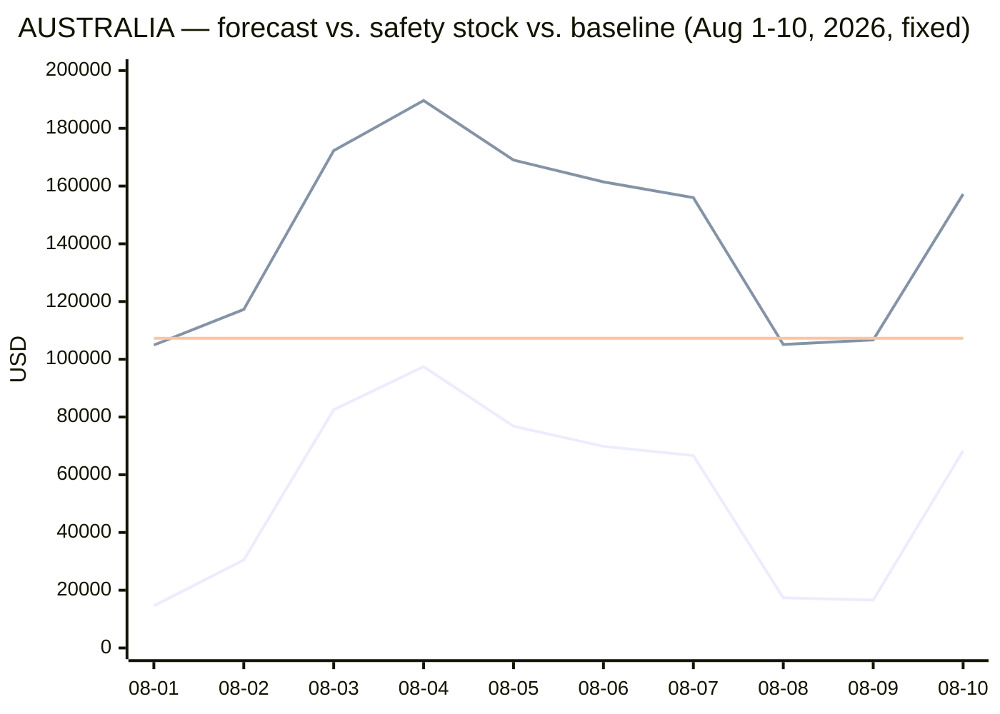

**Before/after: what the fix actually changed, and what it didn't:**

| | Before (additive, buggy) | After (multiplicative, fixed) |
| --- | --- | --- |
| Weekend `yhat` (Aug 1/2/8/9) | **$0.00, all four** | $14,584 / $30,508 / $17,355 / $16,567 |
| `total_shortfall_usd` | $699,788.75 | $371,736.94 |
| `avg_daily_requirement_usd` | $66,151.16 | $54,057.29 |
| `days_with_shortfall` | 6 | 7 |
| `safety_stock_ratio` | 2.4672 | **2.6629 — went up, not down** |

That last row is the honest, slightly counter-intuitive result worth calling out explicitly:
fixing the false-zero defect did **not** shrink `safety_stock_ratio`. This corridor's high
ratio was never purely a clipping artifact — cross-checking `app/README.md`'s existing
"sparse/spiky corridor" caveat, AUSTRALIA's real day-to-day volatility (weekday values from
$62K–$300K+, weekend values from near-zero to $295K on record) genuinely produces a wide 80%
uncertainty band on its own. The fix corrected a *specific, false* $0.00 defect; it did not
make this corridor less volatile. Both are true at once, and conflating them would have been
the wrong lesson to draw from this exercise.

**What the fix is not:** it doesn't guarantee every corridor's forecast is now "correct" in
some absolute sense — Prophet is still a statistical model with the same limited-history
caveats already documented in `app/README.md` (holiday effects noisy at ~2.5 years, a single
evaluation holdout being a small sample, etc.). What it removes is one specific, verifiable
failure mode: a mathematically-possible-but-nonsensical negative sum on a real, transacting
day getting silently presented as a confident zero.

### 10.7 Sequence diagram, instantiated for this run

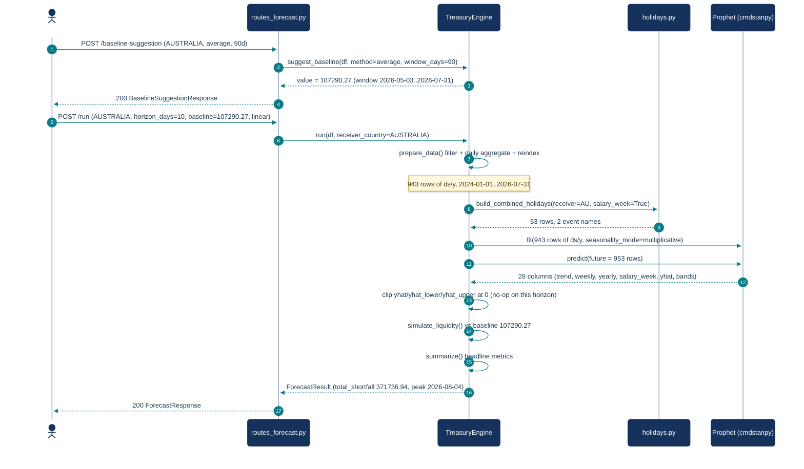

Note the call ownership here, which differs from a naive reading of §3.1: `routes_forecast.py`
only ever calls `TreasuryEngine`. It is **`TreasuryEngine.train_forecast()`** that calls
`build_combined_holidays()` and Prophet — the route never touches either directly (that's the
layering rule in §2).

`fit(... seasonality_mode=multiplicative)` is called out explicitly here because it's the one
argument in this whole diagram that wasn't in the original (pre-fix) version of this section —
every other call shape and column count is identical between the buggy and fixed runs; only
this one argument, and everything numeric downstream of it, changed.

**Column lineage for this run** (raw CSV → final response), the concrete version of the
`prepare_data`/`train_forecast`/`simulate_liquidity` column-diff logging described in §4.3:

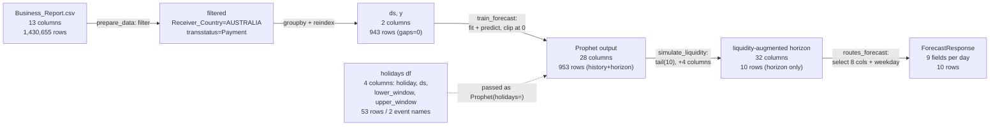

Column counts at each hop, as actually logged by `_log_column_diff` (`engine.py:34-46`):

- **13 → 2** (`prepare_data`): the entire raw schema collapses to `ds`/`y`.
- **2 → 28** (`train_forecast`): Prophet adds trend, the two seasonalities, the two holiday
  regressors, `additive_terms`/`multiplicative_terms`, `yhat`, and a `_lower`/`_upper` band for
  every one of those.
- **28 → 32** (`simulate_liquidity`): the four liquidity columns, on the 10 horizon rows only.
- **32 → 9 per day** (`routes_forecast._run_engine_sync`): the response deliberately exposes only
  `ds`, `weekday`, `yhat`, `yhat_lower`, `yhat_upper`, `safety_stock`, `daily_shortfall`,
  `cumulative_shortfall`, `liquidity_to_volume_ratio` — the internal component columns stay
  server-side (the trend chart is rendered from them separately by `charts.py`).
